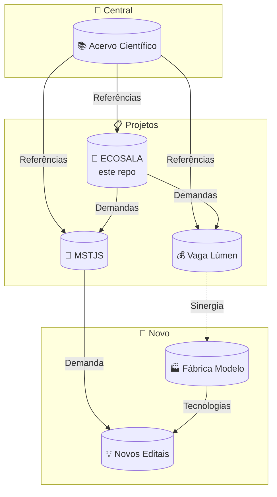

# 🎓 ECOSALA — Coletivo de Formação e Ação em Agroecologia

> 🌿 **Bem Viver** — Somos um encontro de trajetórias diversas que convergem em um propósito comum: a construção de mundos onde a vida, em todas as suas formas, ocupe o centro das relações sociais, econômicas e políticas.
>
> Não há aqui uma única disciplina, uma única origem ou uma única voz. Somos agrônomos, arquitetos, microbiologistas, engenheiros, educadoras, nutricionistas, psicólogas, gestoras comunitárias, desenvolvedores e pesquisadores autodidatas. Atuamos em institutos federais, centros de pesquisa, universidades, assentamentos da reforma agrária, Áreas de Proteção Ambiental e periferias urbanas.
>
> O que nos une não é um título, mas uma convicção: a de que a ciência deve servir à terra e aos povos que nela habitam. Trabalhamos com agroecologia e bioconstrução, com bambu e poliuretano vegetal, com saneamento ecológico e bioeconomia regenerativa, com tecnologias sociais que emergem do chão das comunidades e retornam a elas como autonomia.
>
> Este repositório é parte desse ecossistema — o **espaço coletivo** onde documentamos atas, projetos, editais e as articulações que fazem o grupo pulsar. Aqui o trabalho não é solitário: cada entrega carrega a marca de quem a construiu.
>
> Seja bem-vinda, bem-vindo. Há lugar para quem chega com vontade de aprender, contribuir e transformar.

## 🧭 O que é este repositório?

Aqui fica a documentação do **ECOSALA**, um coletivo formado por **12 pesquisadores,
professores e profissionais** que atuam na retaguarda técnica de comunidades da 
reforma agrária, APAs e periferias urbanas.

**👥 Para quem?** Membros do coletivo, parceiros acadêmicos e financiadores.

**🎯 Missão:** Articular formação, pesquisa e ação em agroecologia, bioconstrução 
e tecnologias sociais, construindo demandas a partir da base.

---

## 🌐 Site do Coletivo

👉 **https://takwaratec.github.io/ECOSALA/**

Lá você encontra tudo organizado: atas, projetos, editais, fichas técnicas e membros.

---

## 📂 O que tem em cada pasta?

| Pasta | O que contém |
|---|---|
| `docs/` | **Documentos do coletivo** — atas, projetos, estudos |
| `docs/ata-05-05-2026.md` | Memorial da reunião inaugural (14 participantes, 151 min) |
| `docs/ecosala-itinerante.md` | Projeto ECOSALA Itinerante (agroecologia massificada) |
| `docs/editais/` | **Editais ativos** — formulários convertidos para .md |
| `docs/12_REUNIOES/` | Memoriais de reuniões e transcrições |
| `docs/10_BNDES_BIOINSUMOS/` | Proposta BNDES Bioinsumos (biochar + pirolenhoso) |
| `docs/11_ESTUDOS_TECNICOS/` | Notas técnicas (biochar, biofertilizantes, bambu) |
| `TRIAGEM-BRUTA/` | Material original NÃO versionado |

---

## 👥 Quem faz parte

| Nome | Formação | Instituição | Área | E-mail |
|---|---|---|---|---|
| Marcos Paron | Agronomia, Dr. Microbiologia | IFSP | Microbiologia, ecoformação | paron@ifsp.edu.br |
| André Blanco | Arquitetura (PUC) | Labiapa | Bioconstrução, geodésicas | arq.andreblanco@gmail.com |
| Fabio Takwara | Autodidata | Tecnologia Takwara | Desenvolvedor IA, pesquisador autodidata em tecnologias sociais com bambu | fabiotakwara@gmail.com |
| Gisele Vilela | Agronomia (UFLA) | Embrapa | Produção orgânica | gisele.vilela@embrapa.br |
| Joaquim Sando | Eng. Agrônomo | MST RP | Articulação territorial | joaquimsando@gmail.com |
| Vicente Borges | Agronomia, Dr. Educação | IFB | Bambu, MPTDF | vicente.silva@ifb.edu.br |
| Raphaela Palma | Nutrição + Psicologia | USP | Saúde Integral | raphaelafmpalma@gmail.com |
| Luci Okino | Gestão comunitária | Estação Luz | Espaço físico | estacao.luz.rp@gmail.com |
| Murillo Miguel | Desenvolvedor web | Terra Viva | Operação de campo | mmiguel.skn@gmail.com |
| Henrique Bueno | Direito, TI | Estação Luz | Gestão | bueno1963@proton.me |
| Luis Felipe | Arquitetura | Labiapa | Projeto complementar | arqfelipearaujo@gmail.com |
| **Daniela Maciel** 🆕 | Tecnologia/Transferência | Embrapa | Inovação, TT | *a confirmar* |

> 👤 **Daniela Maciel** entrou em 26/06/2026 (adic. por Gisele). Atua em transferência de tecnologia na Embrapa. Pedimos seu histórico pessoal para complementar a ficha.
> 👥 **Também participam:** Leonardo e Reinaldo Tronto (IFSP Sertãozinho) — conectados por Marcos Paron.

---

## 📋 Editais ativos

| Edital | Prazo | Situação | Acessar |
|---|---|---|---|
| FINEP Mais Inovação — Vaga Lúmen | Fluxo contínuo | Em elaboração | [📄 abrir](https://github.com/takwaratec/fundo-vaga-lumen-2026) |
| BNDES Bioinsumos | A confirmar | Minuta | [📄 abrir](https://github.com/takwaratec/ECOSALA/blob/main/docs/10_BNDES_BIOINSUMOS/GABARITO_BNDES_BIOINSUMOS_ECOSALA.md) |
| Fundo Casa Socioambiental | 30/jun | Novo | [📄 abrir](https://github.com/takwaratec/plataforma-juventude-solidaria-2026/blob/main/docs/editais/editais.md) |
| FEHIDRO | A confirmar | Não iniciado | `docs/editais/` |
| **🏆 Zayed Award 2027** 🆕 | **01/10/2026** | **Rascunho** | [📄 dossiê](https://github.com/takwaratec/ECOSALA/blob/main/docs/editais/zayed-award-2027-dossie.md) |

---

## 📚 Acervo científico

Pesquisas, fichas técnicas e referenciais para embasar novos projetos:
👉 **https://takwaratec.github.io/Analises-e-escrita-cientifica/**

### Fichas individuais dos membros ECOSALA
Disponíveis em: [github.com/takwaratec/Analises-e-escrita-cientifica/tree/main/docs/analyses/ecosala](https://github.com/takwaratec/Analises-e-escrita-cientifica/tree/main/docs/analyses/ecosala)

> 👉 **Se você tem artigos, teses ou capítulos publicados que não foram encontrados, abra uma Issue ou envie o link do seu Lattes/ORCID.**

### 🆕 Perfis de Pesquisadores e Análises COP30

O acervo foi expandido com fichas de grande relevância para o advocacy e a fundamentação técnica do coletivo:

**Perfis de Pesquisadores — Referências históricas da construção com bambu:**
| Pesquisador | Ficha |
|---|---|
| Khosrow Ghavami (PUC-Rio) — Propriedades mecânicas do bambu | [perfil-khosrow-ghavami.md](https://github.com/takwaratec/Analises-e-escrita-cientifica/blob/main/docs/analyses/tecnologia-takwara/perfil-khosrow-ghavami.md) |
| Antônio L. Beraldo / Marco A. R. Pereira (UNICAMP) — Tratamentos, painéis, design | [perfil-beraldo-pereira.md](https://github.com/takwaratec/Analises-e-escrita-cientifica/blob/main/docs/analyses/tecnologia-takwara/perfil-beraldo-pereira.md) |
| Jayme Gonçalves (UNICAMP) — Geodésicas, estruturas | [perfil-jayme-goncalves.md](https://github.com/takwaratec/Analises-e-escrita-cientifica/blob/main/docs/analyses/tecnologia-takwara/perfil-jayme-goncalves.md) |
| Oscar Hidalgo — Bambu na construção civil (referência clássica) | [perfil-oscar-hidalgo.md](https://github.com/takwaratec/Analises-e-escrita-cientifica/blob/main/docs/analyses/tecnologia-takwara/perfil-oscar-hidalgo.md) |
| Simón Vélez — Geodésicas e estruturas emblemáticas | [perfil-simon-velez.md](https://github.com/takwaratec/Analises-e-escrita-cientifica/blob/main/docs/analyses/tecnologia-takwara/perfil-simon-velez.md) |
| José Ripper — Coberturas e conexões | [perfil-jose-ripper.md](https://github.com/takwaratec/Analises-e-escrita-cientifica/blob/main/docs/analyses/tecnologia-takwara/perfil-jose-ripper.md) |

**Análises Políticas e Advocacy — COP30 e políticas do bambu:**
| Análise | Link |
|---|---|
| Dossiê COP30 | [ficha-dossie-cop30.md](https://github.com/takwaratec/Analises-e-escrita-cientifica/blob/main/docs/analyses/tecnologia-takwara/ficha-dossie-cop30.md) |
| Análise crítica: A Dupla Face da Liderança Climática Brasileira | [ficha-analise-cop30.md](https://github.com/takwaratec/Analises-e-escrita-cientifica/blob/main/docs/analyses/tecnologia-takwara/ficha-analise-cop30.md) |
| Floresta em Pé como ativo econômico | [ficha-floresta-em-pe.md](https://github.com/takwaratec/Analises-e-escrita-cientifica/blob/main/docs/analyses/tecnologia-takwara/ficha-floresta-em-pe.md) |
| Casa Floresta — Habitação bioinspirada | [ficha-casa-floresta-cop30.md](https://github.com/takwaratec/Analises-e-escrita-cientifica/blob/main/docs/analyses/tecnologia-takwara/ficha-casa-floresta-cop30.md) |
| Decreto Presidencial do Bambu | [ficha-decreto-presidencial-bambu.md](https://github.com/takwaratec/Analises-e-escrita-cientifica/blob/main/docs/analyses/tecnologia-takwara/ficha-decreto-presidencial-bambu.md) |
| Ultimato Climático — Resenha crítica | [resenha-ultimato-climatico.md](https://github.com/takwaratec/Analises-e-escrita-cientifica/blob/main/docs/analyses/tecnologia-takwara/resenha-ultimato-climatico.md) |

Acesse o acervo completo em: [github.com/takwaratec/Analises-e-escrita-cientifica/tree/main/docs/analyses/tecnologia-takwara/](https://github.com/takwaratec/Analises-e-escrita-cientifica/tree/main/docs/analyses/tecnologia-takwara/)

---

## 🔗 Repositórios irmãos

- **Juventude Solidária** (MSTJS): [github.com/takwaratec/plataforma-juventude-solidaria-2026](https://github.com/takwaratec/plataforma-juventude-solidaria-2026)
- **Vaga Lúmen** (FINEP): [github.com/takwaratec/fundo-vaga-lumen-2026](https://github.com/takwaratec/fundo-vaga-lumen-2026)
- **Análises Científicas**: [github.com/takwaratec/Analises-e-escrita-cientifica](https://github.com/takwaratec/Analises-e-escrita-cientifica)
- **Fábrica Modelo** 🔮: Projeto em discussão com André/Maurílio — prototipagem industrial

---

## 📲 Como baixar este repositório

Botão verde **Code** → **Download ZIP** no GitHub.  
Ou acesse os arquivos .md direto no navegador — abrem formatados automaticamente.

---

*Atualizado: 26/06/2026 · 12 membros · WhatsApp depurado · Tecnologia Takwara*
