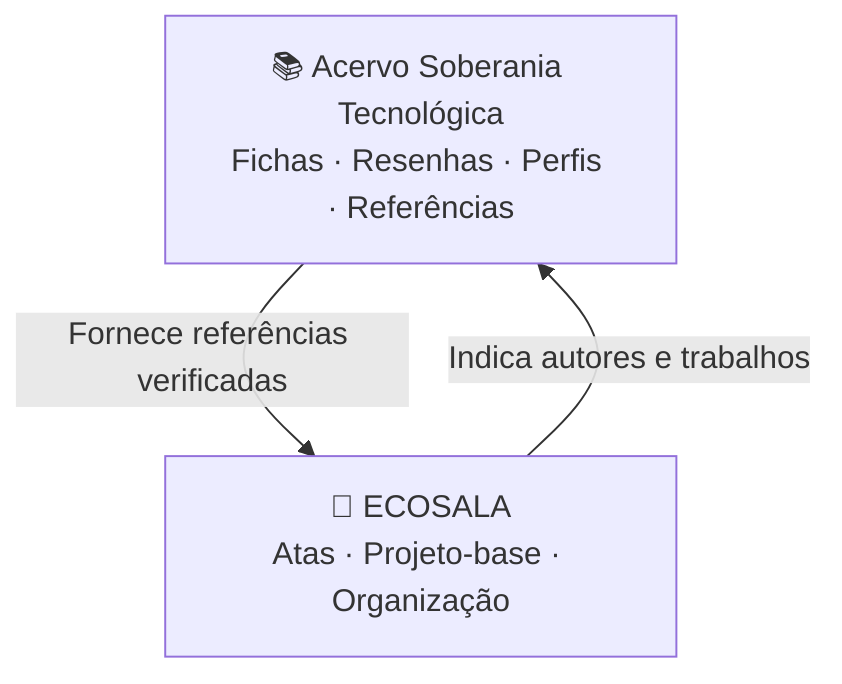

# 🎓 ECOSALA — Coletivo de Formação e Ação em Agroecologia

> ⚠️ **Repositório público** — O código, os documentos versionados e o site podem ser acessados publicamente. Somente materiais autorizados para divulgação devem ser commitados. Conteúdo interno ou restrito deve permanecer fora deste repositório.
>
> 🎋 **Acelerador de resultados, não vitrine** — Como o bambu, que não cresce isolado mas em rede de rizomas subterrâneos, cada repositório deste ecossistema só ganha sentido quando vinculado a um projeto real. Não expomos conhecimento para validação externa — aceleramos quem está na ponta.
>
> Trabalhamos sob duas bússolas. As **7 Lições do Bambu** nos lembram que é preciso curvar sem quebrar, criar raízes profundas, cooperar em comunidade, crescer com foco, colecionar nós de aprendizado, permanecer ocos de certezas e buscar o bem comum. Os **7 Pilares de Edgar Morin** para a educação do futuro nos ancoram no pensamento complexo: o conhecimento só é pertinente quando enfrenta a incerteza, ensina a condição humana e se compromete com a ética.
>
> 🌱 **Este repositório** é o espaço coletivo do grupo — atas, projetos, editais e a articulação que faz o coletivo pulsar. 12 pesquisadores organizados em torno de demandas reais dos territórios: reforma agrária, APAs, periferias urbanas.

## 🌐 Site do Coletivo

👉 **https://takwaratec.github.io/ECOSALA/**

---

## 📂 O que tem em cada pasta?

| Pasta | O que contém |
|---|---|
| `docs/` | **Documentos do coletivo** — atas, projetos, estudos |
| `docs/ata-05-05-2026.md` | Memorial da reunião inaugural (14 participantes, 151 min) |
| `docs/ecosala-itinerante.md` | Projeto ECOSALA Itinerante (agroecologia massificada) |
| `docs/editais/` | **Editais ativos** — formulários convertidos para .md |
| `docs/12_REUNIOES/` | Memoriais de reuniões e transcrições |
| `docs/10_BNDES_BIOINSUMOS/` | Proposta BNDES Bioinsumos (biochar + pirolenhoso) |
| `docs/11_ESTUDOS_TECNICOS/` | Notas técnicas (biochar, biofertilizantes, bambu) |
| `TRIAGEM-BRUTA/` | Material original NÃO versionado |

---

## 👥 Quem faz parte

| Nome | Formação | Instituição | Área |
|---|---|---|---|
| Marcos Paron | Agronomia, Dr. Microbiologia | IFSP | Microbiologia, ecoformação |
| André Blanco | Arquitetura | Labiapa | Bioconstrução, geodésicas |
| Fabio Takwara | Autodidata | Tecnologia Takwara | Tecnologias sociais, bambu e documentação |
| Gisele Vilela | Agronomia | Embrapa | Produção orgânica |
| Joaquim Sando | Engenharia Agronômica | MST RP | Articulação territorial |
| Vicente Borges | Agronomia, Dr. Educação | IFB | Bambu e formação |
| Raphaela Palma | Nutrição e Psicologia | USP | Saúde integral |
| Luci Okino | Gestão comunitária | Estação Luz | Espaço físico |
| Murillo Miguel | Desenvolvimento web | Terra Viva | Operação de campo |
| Henrique Bueno | Direito e TI | Estação Luz | Gestão |
| Luis Felipe | Arquitetura | Labiapa | Projeto complementar |
| Daniela Maciel | Transferência de tecnologia | Embrapa | Inovação e avaliação de impacto |

> 👤 **Daniela Maciel** entrou em 26/06/2026 (adic. por Gisele). Atua em transferência de tecnologia na Embrapa. Pedimos seu histórico pessoal para complementar a ficha.
> 👥 **Também participam:** Leonardo e Reinaldo Tronto (IFSP Sertãozinho) — conectados por Marcos Paron.

---

## 📋 Editais ativos

| Edital | Prazo | Situação | Acessar |
|---|---|---|---|
| BNDES Bioinsumos | A confirmar | Minuta | [📄 abrir](https://github.com/takwaratec/ECOSALA/blob/main/docs/10_BNDES_BIOINSUMOS/GABARITO_BNDES_BIOINSUMOS_ECOSALA.md) |
| FEHIDRO | A confirmar | Não iniciado | `docs/editais/` |
| **🏆 Zayed Award 2027** 🆕 | **01/10/2026** | **Rascunho** | [📄 dossiê](https://github.com/takwaratec/ECOSALA/blob/main/docs/editais/zayed-award-2027-dossie.md) |

---

## 📚 Acervo Soberania Tecnológica

O acervo científico e tecnológico do ecossistema está disponível no [site público do Acervo Soberania Tecnológica](https://takwaratec.github.io/acervo-soberania-tecnologica/).

### Adesão dos participantes

Cada integrante da ECOSALA é convidado a encaminhar:

1. Currículo Lattes, ORCID e vínculo institucional verificável;
2. uma apresentação profissional breve;
3. até cinco trabalhos prioritários de sua autoria;
4. links para as fontes integrais e DOI, ISBN ou ISSN, quando existentes;
5. referências essenciais de sua área.

Os materiais passam por curadoria documental antes da publicação. O acervo distingue produção científica, documento técnico, experiência profissional e formulação autoral. Textos integrais protegidos, dados pessoais e documentos internos não devem ser enviados para publicação.

---

## 🔗 Relação com o Acervo

```mermaid
flowchart TB
    AC["📚 Acervo Soberania Tecnológica<br/>Fichas · Resenhas · Perfis · Referências"]
    EC["🌱 ECOSALA<br/>Atas · Projeto-base · Organização"]
    AC -->|"Fornece referências verificadas"| EC
    EC -->|"Indica autores e trabalhos"| AC
```

Outras relações entre repositórios e projetos somente serão apresentadas após revisão fina dos documentos e alinhamento de propósitos entre os participantes.

---

## 📲 Como baixar este repositório

Botão verde **Code** → **Download ZIP** no GitHub.  
Ou acesse os arquivos .md direto no navegador — abrem formatados automaticamente.

---

*Atualizado: 30/07/2026 · 12 membros · documentação pública em revisão*
