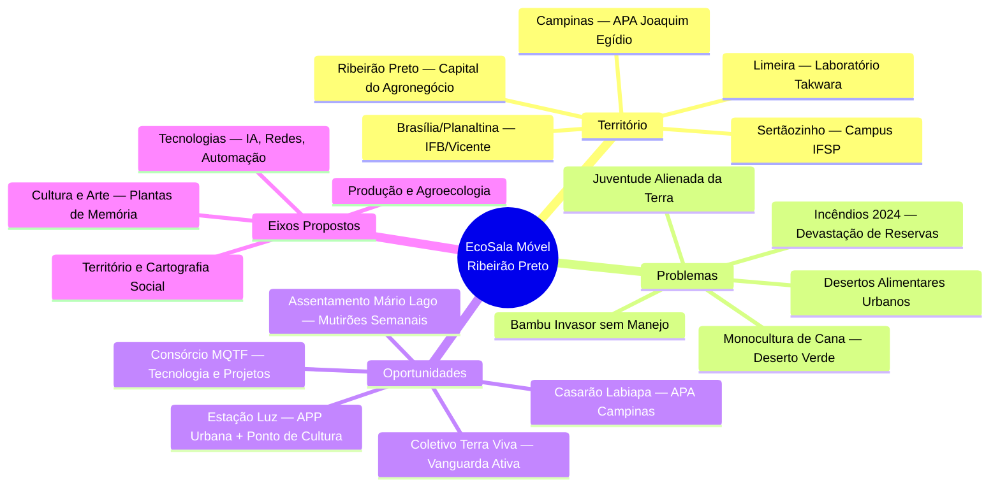
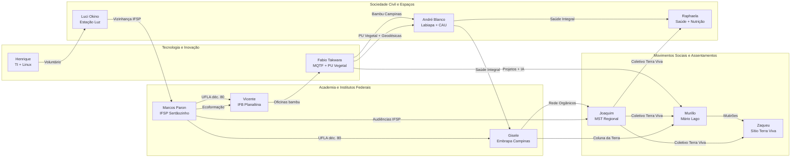
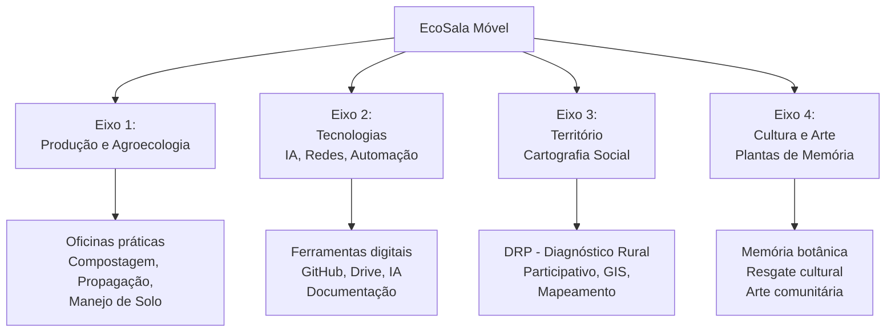

# Memorial Descritivo — Reunião Inaugural: EcoSala Móvel

**Data**: 05 de maio de 2026, 07h58 – 10h30 (2h31min)
**Modalidade**: Videoconferência (Microsoft Teams)
**Convocação**: Prof. Dr. Marcos Eduardo Paron (IFSP — Campus Sertãozinho/Ribeirão Preto)

---

## 1. Contextualização Prévia

### 1.1. O Conceito: EcoSala Móvel

A **EcoSala Móvel** é uma proposta de unidade educacional itinerante idealizada pelo Prof. Marcos Paron, com raízes em experiências anteriores nos campi do IFSP (São Roque e Sertãozinho). O conceito original — uma "ecossala" fixa como farol agroecológico dentro de uma instituição de ensino — evoluiu para um modelo móvel, capaz de transitar entre territórios (assentamentos, APAs, periferias urbanas) levando oficinas práticas, infraestrutura mínima de formação e articulação comunitária.

A motivação central é **inverter a lógica top-down** das políticas públicas educacionais e científicas, construindo demandas a partir da base — das comunidades, dos assentamentos, dos coletivos — para depois buscar chancela institucional e financiamento.

### 1.2. Diagnóstico Territorial: Ribeirão Preto e Região

A região de Ribeirão Preto/Sertãozinho constitui um dos epicentros do agronegócio brasileiro, com características que criam um paradoxo socioambiental agudo:

| Dimensão | Diagnóstico |
|---|---|
| **Urbanização** | 99% da população em área urbana. Estranhamento generalizado da juventude com o solo, a terra e a produção rural. |
| **Monocultura** | Domínio absoluto da cana-de-açúcar. Paisagem homogênea. Poucas áreas de remanescente florestal. |
| **Incêndios (2024)** | Devastação massiva de reservas legais nos assentamentos (Mário Lago) e em APAs (Reserva Augusto Ruschi — destruída). Evento-gatilho para mobilização comunitária. |
| **Reforma Agrária** | 4 assentamentos e 5 acampamentos na regional. O MST opera com princípio agroecológico mas enfrenta escassez de recursos e ATER. |
| **Bambu invasor** | ~100 mil hectares de bambu sem manejo na Grande Campinas/interior SP. Espécie invasora que pode ser convertida em recurso construtivo. |
| **Desertos alimentares** | Periferias urbanas sem acesso a alimentos frescos. Programa federal de Agricultura Urbana e Periurbana em fase de implantação. |
| **Narcotráfico** | Pressão crescente nas bordas de APAs urbanas e em áreas institucionais abandonadas (entorno do Campus IFSP). |
| **Instituto Federal** | Campus em formação em Ribeirão Preto. Eixo curricular aprovado: Matemática (diretriz MEC/Camilo Santana). Curso de agroecologia **não foi aprovado** nas audiências públicas, mas existe compromisso verbal de "espaço agroecológico" no campus. |

### 1.3. Região Geográfica em Destaque

A reunião articula atores de **quatro polos geográficos** com conexões complementares:

| Polo | Características | Atores |
|---|---|---|
| **Ribeirão Preto / Sertãozinho** | Epicentro. Campus IFSP, assentamentos MST, Estação Luz (APP urbana). | Marcos, Luci, Joaquim, Murillo, Zaqueu, Raphaela, Henrique, Messias |
| **Campinas / Joaquim Egídio** | APA com 10 ocupações urbanas. Casarão Labiapa. Bambuzal nativo. | André Blanco, Luis Felipe |
| **Limeira** | Laboratório de PU Vegetal e bambu. Oficina montada. Universidade (André dá aula). | Fabio Takwara |
| **Brasília / Planaltina** | IFB. Forno de tratamento instalado. Histórico de oficinas comunitárias com bambu. | Vicente |

---

## 2. Perfil dos Participantes

### 2.1. Marcos Eduardo Paron — *O Articulador*

| Campo | Dados |
|---|---|
| **Instituição** | IFSP — Instituto Federal de São Paulo (18 anos) |
| **Formação** | Agronomia (UFLA, déc. 80), Mestrado em Solos, Doutorado em Microbiologia do Solo (Micorrizas), Pós-Doc em Plantas Medicinais e Cervejaria |
| **Localização** | Sertãozinho / Ribeirão Preto, SP |
| **Papel na reunião** | Convocante e idealizador. Apresentou o conceito da EcoSala Móvel. |
| **Experiência-chave** | Coordenou Núcleo de Agroecologia (MDA) e CVT (CNPq/MDA). Construiu ecossalas em São Roque e Sertãozinho. Atualmente leciona no curso técnico de Cervejaria. |
| **Posição política** | Crítico à lógica top-down institucional. Defende construção de demanda pela base. Não representa o IFSP nesta iniciativa — atua como cidadão/educador. |
| **Conceito-chave** | *Ecoformação* (Dalva Serrano): hétero + auto + eco formação. "Plantas de memória" como vetor de reconexão cultural. |

### 2.2. André Blanco — *O Bio-Arquiteto*

| Campo | Dados |
|---|---|
| **Formação** | Arquitetura e Urbanismo (PUC Campinas). Bio-arquiteto, ambientalista. |
| **Localização** | Joaquim Egídio, APA de Campinas, SP |
| **Instituições** | Labiapa (gestão comunitária de APA), Sindicato dos Arquitetos, Conselho de Arquitetura (CAU — R$ 5M/ano em projetos comunitários). |
| **Experiência-chave** | 30+ anos de docência. Projeto ACTA (PUC/Piracicaba). Espaço Viveiros (12 anos). Casarão restaurado na beira do Ribeirão das Cabras. Oficinas de geodésicas com bambu, tintas minerais, bioconstrução. |
| **Recurso concreto** | Bambuzal grande na APA Joaquim Egídio. Casarão disponível como espaço de formação. Projeto "Ecoando" (ônibus itinerante, conceito similar à EcoSala). |
| **Conexão MQTF** | Geodésicas com bambu, tintas minerais, recuperação de patrimônio, projetos comunitários de habitação (CDHU, Minha Casa Minha Vida). |

### 2.3. Fabio Takwara — *O Inventor*

| Campo | Dados |
|---|---|
| **Formação** | Autodidata. Jornalista investigativo, fotógrafo, editor gráfico, programador Python. |
| **Localização** | Limeira, SP (com oficina/laboratório montado) |
| **Projeto principal** | **Consórcio MQTF** (UnB/UFAC/UFRR) — Mulheres Que Tecem a Floresta. Repositório GitHub com governança aberta. |
| **Experiência-chave** | Geodésica da Rio+20 montada em 1h30 (conexão por esticadores de cabo de aço). Oficinas no IFB Planaltina com Vicente. Papéis de fibra de bananeira exportados para Europa. Campanha Turma do Cerradinho (educação ambiental em todas as escolas do DF). |
| **Tecnologia proprietária** | PU Vegetal (resina de mamona) como aglutinante atóxico para bambu e fibras. Protocolo Diquada + Pirolenhoso + PU Vegetal. |
| **Oferta concreta** | Oficina em Limeira disponível para hospedagem e formação (até 4 pessoas). Elaboração de projetos via IA. Diagnósticos territoriais. Captação de editais. |

### 2.4. Gisele Freitas Vilela — *A Conectora Institucional*

| Campo | Dados |
|---|---|
| **Instituição** | Embrapa Campinas (13 anos). Pesquisadora. |
| **Formação** | Agronomia (UFLA, contemporânea de Marcos e Vicente). |
| **Papel estratégico** | Comissão de Produção Orgânica do Estado de SP. Projeto Pro-Orgânico (Organoteca — banco de materiais técnicos da Embrapa para agroecologia). |
| **Rede** | Rede sociotécnica ampla: OCS, associações de assistência técnica, setor público, Ministério, produtores do Sul de Minas e Sul do Brasil. Parceira do Coletivo Terra Viva (Coluna da Terra). |
| **Oferta** | Pontes institucionais. Materiais técnicos da Embrapa para ATER agroecológica. |

### 2.5. Joaquim Lauro Sando — *O Estrategista Territorial*

| Campo | Dados |
|---|---|
| **Formação** | Engenheiro Agrônomo |
| **Posição** | Coordenador Estadual do MST — Regional Ribeirão Preto (4 assentamentos, 5 acampamentos). |
| **Papéis institucionais** | Presidente do Conselho de Segurança Alimentar de Ribeirão Preto. Integra o Programa Federal de Agricultura Urbana e Periurbana. Treinamento (a partir de 07/05) para Plano Municipal de Agricultura Urbana. |
| **Experiência** | Projeto de cerveja com manipueira (c/ Prof. Jean — IFSP) — submetido ao FINEP (R$ 3M, não aprovado; será reapresentado). Participou de todas as audiências públicas do Campus IFSP Ribeirão. |
| **Posição estratégica** | Articulador MST + Instituto Federal + Conselho de Segurança Alimentar. Defende uso de Drive (não WhatsApp) para produção de documentos. |

### 2.6. Luci Okino — *A Guardiã do Território*

| Campo | Dados |
|---|---|
| **Instituição** | Presidente da **Estação Luz — Espaço Experimental de Tecnologias Sociais** |
| **Localização** | APP urbana vizinha ao Campus IFSP Ribeirão Preto |
| **Status** | Ponto de Cultura. Ex-Sala Verde (MMA). Atuante desde 2008. |
| **Oferta** | Espaço físico para laboratório vivo agroecológico. Parceria direta com IFSP. |
| **Desafio** | Narcotráfico no entorno. Retomada pós-pandemia. |
| **Web** | www.estacaoluz.org | IG: @estacao.luz.rp |

### 2.7. Murillo Miguel — *A Vanguarda do Campo*

| Campo | Dados |
|---|---|
| **Posição** | Assentado e militante no Assentamento Mário Lago (MST), Ribeirão Preto. Dirigente do Coletivo Terra Viva. |
| **Formação complementar** | Desenvolvedor web (back-end e front-end). |
| **Ação em curso** | Mutirões semanais (todo domingo desde 2024) para recuperação de reserva devastada por incêndios. ~4 hectares de reflorestamento com agrofloresta. Atividades culturais (cineclube, debates políticos). |
| **Oferta** | Infraestrutura no assentamento para oficinas. Organização logística (cronograma mensal com coordenadores rotativos). Apoio técnico em desenvolvimento web. |

### 2.8. Raphaela Palma — *A Ponte Saúde-Alimento*

| Campo | Dados |
|---|---|
| **Formação** | Nutricionista + Psicóloga. Mestre em Saúde Pública (USP Ribeirão). |
| **Foco** | Educação nutricional popular. Práticas Integrativas (PICS). Ativista do SUS. Desertos alimentares. |
| **Posição** | Integra o Coletivo Terra Viva. Retornou a Ribeirão Preto em 2025. |
| **Conexão** | Saúde Integral = Agroecologia + Saúde da Família + Saúde do Habitar (projeto com André Blanco e Gisele). |

### 2.9. Vicente de Paulo Borges Virgolino da Silva — *O Educador do Campo*

| Campo | Dados |
|---|---|
| **Instituição** | IFB — Instituto Federal de Brasília, Campus Planaltina (desde 1995). |
| **Formação** | Agronomia (UFLA, déc. 80), Doutorado em Educação do Campo. Passagem pela Embrapa CPAC. |
| **Experiência** | Curso de Tecnologia em Agroecologia (um dos primeiros do Centro-Oeste). Núcleo ECOA (espaço de convivência agroecológica com adobe e bambu). Oficinas comunitárias de bambu com Fabio Takwara (3 ciclos: manejo → tratamento → construção da habitação em 3 finais de semana). |
| **Recurso** | Forno de tratamento de bambu instalado no IFB Planaltina. Disponível para visitas e reativação. |

### 2.10. Outros Participantes

| Nome | Papel | Nota |
|---|---|---|
| **Zaqueu** (Sítio Terra Viva) | Assentado no Mário Lago. Membro do Coletivo Terra Viva. Guardião de área de reserva. | Espaço em reforma para cursos. Interesse forte em bioconstrução e viveiro com bambu. |
| **Henrique Bueno** | Formação em Direito. Especialista em TI (Linux desde anos 90). Voluntário na Estação Luz. | Ex-agente administrativo (Prefeitura Ribeirão — Licitações; PROCON Praia Grande). Disponível integralmente. |
| **Messias** (pai de Danilo Cardoso) | Paisagista urbano. Ligado à Estação Luz há 30 anos. | Pretende continuar na vertente ecológica do paisagismo. |
| **Luis Felipe Araujo** | Arquiteto e urbanista. Parceiro de André Blanco no Labiapa e em projetos de habitação social. | Contato: 19 993484674 |
| **Reinaldo Tronto** | Presente mas sem fala registrada. | A confirmar perfil e interesse. |

---

## 3. Mapa de Conexões e Interesses Mútuos

### 3.1. Eixos de Convergência Identificados

| Eixo | Atores Centrais | Potencial |
|---|---|---|
| **Agroecologia aplicada em assentamentos** | Joaquim, Murillo, Zaqueu, Marcos | Oficinas práticas no Mário Lago. Modelo replicável para os 4 assentamentos da regional. |
| **Bioconstrução e Bambu** | André, Fabio, Vicente, Zaqueu | Geodésicas, viveiros, habitação. Bambuzal do André (Campinas) e laboratório do Fabio (Limeira) como bases de formação. |
| **Saúde Integral** (Agroecologia + Saúde da Família + Habitar) | Raphaela, André, Gisele | Projeto transversal com potencial de financiamento via SUS/PICS e CAU. |
| **Segurança Alimentar Urbana** | Joaquim, Raphaela, Gisele | Plano Municipal de Agricultura Urbana (em construção). Cozinhas comunitárias (Mãos Solidárias). |
| **Tecnologia e Documentação** | Fabio, Henrique, Murillo | GitHub, IA generativa, desenvolvimento web, Drive compartilhado. Memória institucional do grupo. |
| **Articulação Institucional** | Gisele, Marcos, Joaquim | Embrapa, IFSP, MST, Conselho de Segurança Alimentar, FINEP. |

---

## 4. Encaminhamentos e Planejamento Estratégico

### 4.1. Deliberações da Reunião

| # | Encaminhamento | Responsável | Prazo |
|---|---|---|---|
| 1 | Criar grupo de WhatsApp | Marcos Paron | Imediato (05/05) |
| 2 | Criar Google Drive compartilhado para documentos | Marcos Paron | Semana de 05–09/05 |
| 3 | Elaborar **minuta de projeto** (2–3 páginas, não acadêmica, sem formato de edital) com eixos e calendário | Marcos Paron | Até 19/05 |
| 4 | Cada participante enviar **1 lauda** com proposta de contribuição pessoal | Todos | Até 30/05 |
| 5 | Registrar memorial da reunião e transcrição | Fabio Takwara | Concluído (este documento) |
| 6 | **2ª Reunião virtual** | Todos | **02 de junho de 2026, 08h00** |
| 7 | **1ª Oficina presencial** (EcoSala Móvel) no Assentamento Mário Lago | Marcos + Murillo + Zaqueu | Final de junho / 2026 |

### 4.2. Quatro Eixos Propostos por Marcos Paron

### 4.3. Recursos Físicos Mapeados

| Local | Tipo | Disponibilidade | Responsável |
|---|---|---|---|
| Assentamento Mário Lago | Campo + espaço comunitário em reforma | Todo domingo (mutirão) | Murillo, Zaqueu |
| Estação Luz (APP Ribeirão) | Ponto de Cultura + laboratório vivo | Em retomada pós-pandemia | Luci Okino |
| Casarão Labiapa (Campinas) | APA Joaquim Egídio + bambuzal | Operacional | André Blanco, Luis Felipe |
| Laboratório Limeira | Oficina com ferramentas, PU Vegetal, bambu | Imediato (4 vagas hospedagem) | Fabio Takwara |
| IFB Planaltina (Brasília) | Forno de tratamento de bambu | Instalado, precisa reativação | Vicente |

---

## 5. Sugestões para Denominação do Grupo

> O nome deve refletir: itinerância, vínculo com a terra, construção coletiva e horizontalidade.

| Proposta | Justificativa |
|---|---|
| **EcoSala Itinerante** | Nome original do projeto de Marcos — simplicidade e clareza. |
| **Raízes Móveis** | Oximoro que captura a essência: ter raiz mas ser móvel. Vínculo + itinerância. |
| **Rede Terreiro** | Referência ao "terreiro" como espaço comunitário de conversa e trabalho. Tom popular e direto. |
| **Coletivo Ecoformação** | Conceito pedagógico central de Marcos (Dalva Serrano). Tom acadêmico mas propositivo. |
| **Mutirão Permanente** | Inspirado na prática já existente no Mário Lago. Ação como identidade. |
| **Chão Vivo** | Referência à microbiologia do solo (formação de Marcos) e à vida que brota do chão. |

---

## 6. Sugestões para Fluidez dos Trabalhos

### 6.1. Recomendações Operacionais

1. **Drive + WhatsApp + E-mail**: Adotar a proposta de Joaquim — WhatsApp para comunicação rápida, Google Drive para documentos estruturados, e-mail para convites e registros formais. Evitar produção textual no WhatsApp.

2. **Agenda compartilhada**: Criar um Google Calendar do grupo (proposta Murillo). Cada reunião com convite formal e link.

3. **Memorial de reuniões**: Manter o padrão de transcrição + memorial (como este documento). Fabio + Murillo como dupla de documentação.

4. **Formato de laudas**: A "lauda de contribuição" pedida por Marcos pode seguir um modelo simples:
   - Nome / Instituição / Território
   - O que sei fazer (competências)
   - O que posso oferecer (recursos concretos: espaço, tempo, equipamento)
   - O que gostaria de aprender/desenvolver

5. **1ª Oficina (Junho)**: Sugestão de tema integrador — *Bioconstrução de Viveiro com Bambu e Materiais Locais*. Reúne os interesses de André (geodésicas), Fabio (tratamento), Zaqueu (viveiro), Marcos (propagação de plantas medicinais) e Murillo (recuperação de reserva).

6. **Não vincular ao IFSP prematuramente**: Marcos foi claro — o projeto nasce como cidadão, não como servidor. A chancela institucional virá quando houver projeto maduro e demanda documentada. Isso protege o grupo de turbulências políticas internas.

7. **Conexão MQTF**: O Consórcio MQTF pode servir como modelo de governança documental (GitHub, transparência, licenciamento aberto) e como parceiro técnico para projetos de biochar, tratamento de bambu e captação de editais.

---

## 7. Próximos Passos Imediatos

- [ ] Grupo WhatsApp criado (Marcos)
- [ ] Google Drive criado e compartilhado (Marcos)
- [ ] Minuta de projeto enviada ao grupo (Marcos — até 19/05)
- [ ] Laudas individuais submetidas (Todos — até 30/05)
- [ ] **2ª Reunião**: 02/06/2026 às 08h00
- [ ] **1ª Oficina presencial**: final de junho, Assentamento Mário Lago

---

> *"A gente só consegue caminhar se a gente tiver realmente engajado com a base, com quem é o usuário final daquilo que a gente tá querendo produzir."*
> — **Prof. Marcos Eduardo Paron**, 05/05/2026

---
